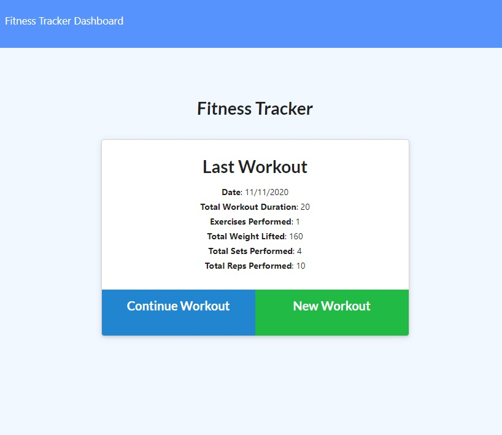
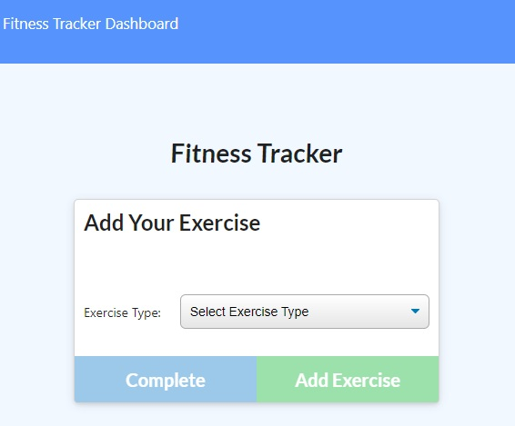
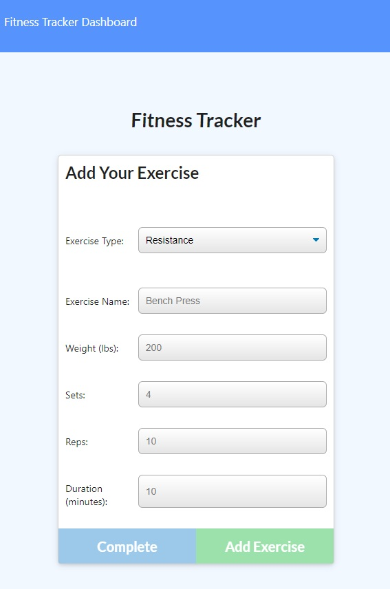
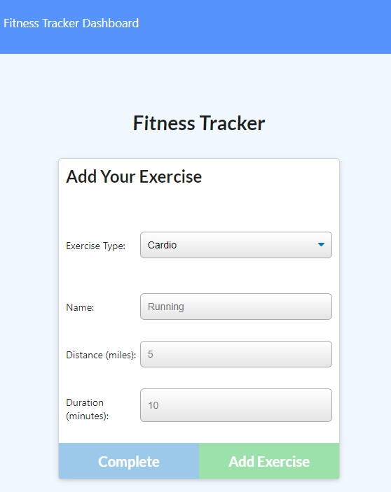
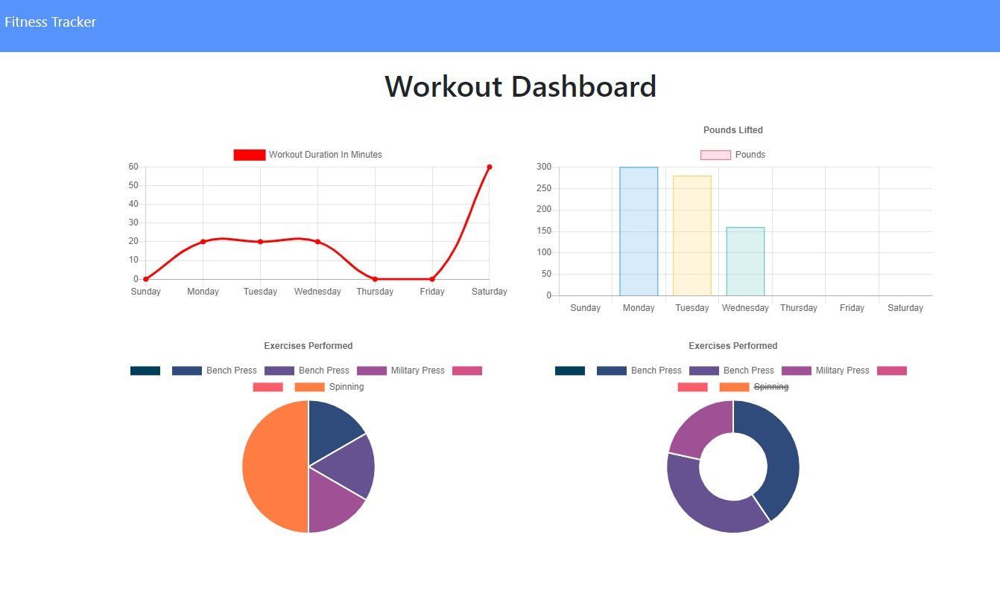

# Fitness Tracker
[](https://opensource.org/licenses/ISC)

[Live Site - https://zar-workout.herokuapp.com/](https://zar-workout.herokuapp.com/)

## Description
A node.js based Express and MongoDB app to track daily workouts and provide a summary for the last week of exercises.



## Table of Contents

1. [Installation](#1-installation)
2. [Usage](#2-usage)
3. [License](#3-license)
4. [Contributing](#4-contributing)
6. [Questions](#5-questions)

## 1 Installation
1. Download repository
	```
	HTTPS: Git clone https://github.com/Zarlengo/Fitness-Tracker.git
    SSH: Git clone git@github.com:Zarlengo/Fitness-Tracker.git
	```

2. Install dependencies
	```
	npm install
	```

3. Add table `workout` to your local mongoDB server

4. Seed the database
    ```
    npm run seed
    ```

5. Start the server
    ```
    npm run start
    ```

6. Navigate to localhost:3000
    [🌎  ==> API Server now listening on PORT 3000!](http://localhost:3000)

## 2 Usage

### 2.1 Welcome Page


#### Continue Workout
Will add the workout to the same day as the last completed workout


#### New Workout
Will create a new workout for today

***

### 2.2 Add Your Exercise




#### Resistance


* Exercise Name - provide a description for the exercise
* Weight - enter the max weight
* Sets - enter the number of sets completed
* Reps - enter the number of repetitions per set
* Duration - enter the time it took to complete the exercise in minutes

#### Cardio


* Name - provide a description for the exercise
* Distance - enter the distance covered in miles
* Duration - enter the time it took to complete the exercise in minutes

***

### 2.3 Dashboard

A snapshot of the previous 7 days

* Workout in minutes
    The cumulative duration of exercises performed per day charted out in a line chart
* Pounds lifted
    The cumulative weight of exercises performed per day charted out in a bar chart
* Exercises performed by time
    The work out duration separated by activity type charted in a pie chart as a percent of the total exercise time
* Exercises performed by weight
    The exercise weight separated by activity type charted in a pie chart as a percent of the total weight lifted


## 3 License
    Copyright © 2020 Chris Zarlengo
    Permission to use, copy, modify, and/or distribute this software for any
    purpose with or without fee is hereby granted, provided that the above
    copyright notice and this permission notice appear in all copies.

    THE SOFTWARE IS PROVIDED "AS IS" AND THE AUTHOR DISCLAIMS ALL WARRANTIES
    WITH REGARD TO THIS SOFTWARE INCLUDING ALL IMPLIED WARRANTIES OF
    MERCHANTABILITY AND FITNESS. IN NO EVENT SHALL THE AUTHOR BE LIABLE FOR ANY
    SPECIAL, DIRECT, INDIRECT, OR CONSEQUENTIAL DAMAGES OR ANY DAMAGES
    WHATSOEVER RESULTING FROM LOSS OF USE, DATA OR PROFITS, WHETHER IN AN ACTION
    OF CONTRACT, NEGLIGENCE OR OTHER TORTIOUS ACTION, ARISING OUT OF OR IN
    CONNECTION WITH THE USE OR PERFORMANCE OF THIS SOFTWARE.

## 4 Contributing
* [Zarlengo](https://github.com/Zarlengo)

## 5 Questions
* [Github Profile for Zarlengo](https://github.com/Zarlengo)
* [Send email to christopher@zarlengo.net](mailto:christopher@zarlengo.net)
* [File an issue](https://github.com/Zarlengo/Fitness-Tracker/issues)
